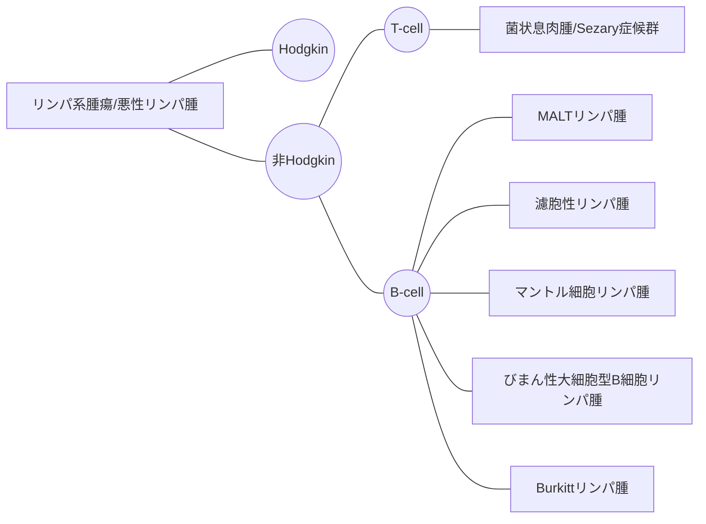

```mermaid
graph LR
A[リンパ系腫瘍/悪性リンパ腫]
B((Hodgkin))
C((非Hodgkin))
D((B-cell))
E((T-cell))
F[MALTリンパ腫]
G[濾胞性リンパ腫]
H[マントル細胞リンパ腫]
I[びまん性大細胞型B細胞リンパ腫]
J[Burkittリンパ腫]
K[菌状息肉腫/Sezary症候群]
A --- B 
A --- C --- E --- K
C --- D ---F
D --- G
D --- H
D --- I
D --- J
```

